Proyecto Final de Curso
================
Nicolás Núñez de Cela Román, Gonzalo Ruiz Espinar y Pablo Soriano
González
04/12/2021

# Preliminares

Cargamos las librerías que vamos a necesitar.

El *dataset* que vamos a utilizar contiene datos sobre la lluvia en
Australia durante casi los últimos 10 años. Se puede utilizar para
predecir si va a llover un día o no. Las fuentes de los datos son
diversas estaciones meteorológicas de australia y el *dataset* se puede
encontrar aquí:
[https://www.kaggle.com/jsphyg/weather-*dataset*-rattle-package](https://www.kaggle.com/jsphyg/weather-*dataset*-rattle-package).

Cargamos el fichero de los datos:

``` r
datos <- read.csv("./data/weatherAUS.csv", header = TRUE, sep = ",")
```

También se puede utilizar la función de tidyverse para leer csv:

``` r
datostiny <- read_csv("./data/weatherAUS.csv")
```

    ## Rows: 145460 Columns: 23

    ## ── Column specification ────────────────────────────────────────────────────────
    ## Delimiter: ","
    ## chr   (6): Location, WindGustDir, WindDir9am, WindDir3pm, RainToday, RainTom...
    ## dbl  (16): MinTemp, MaxTemp, Rainfall, Evaporation, Sunshine, WindGustSpeed,...
    ## date  (1): Date

    ## 
    ## ℹ Use `spec()` to retrieve the full column specification for this data.
    ## ℹ Specify the column types or set `show_col_types = FALSE` to quiet this message.

# Análisis exploratorio

Para conocer una primera información sobre el conjunto de datos,
ejecutamos el siguiente comando, que nos permite conocer cuántas
observaciones tiene el *dataset* y cuántas variables, además del tipo de
dato que es cada una de ellas y sus primeros valores.

``` r
str(datos)
```

    ## 'data.frame':    145460 obs. of  23 variables:
    ##  $ Date         : chr  "2008-12-01" "2008-12-02" "2008-12-03" "2008-12-04" ...
    ##  $ Location     : chr  "Albury" "Albury" "Albury" "Albury" ...
    ##  $ MinTemp      : num  13.4 7.4 12.9 9.2 17.5 14.6 14.3 7.7 9.7 13.1 ...
    ##  $ MaxTemp      : num  22.9 25.1 25.7 28 32.3 29.7 25 26.7 31.9 30.1 ...
    ##  $ Rainfall     : num  0.6 0 0 0 1 0.2 0 0 0 1.4 ...
    ##  $ Evaporation  : num  NA NA NA NA NA NA NA NA NA NA ...
    ##  $ Sunshine     : num  NA NA NA NA NA NA NA NA NA NA ...
    ##  $ WindGustDir  : chr  "W" "WNW" "WSW" "NE" ...
    ##  $ WindGustSpeed: int  44 44 46 24 41 56 50 35 80 28 ...
    ##  $ WindDir9am   : chr  "W" "NNW" "W" "SE" ...
    ##  $ WindDir3pm   : chr  "WNW" "WSW" "WSW" "E" ...
    ##  $ WindSpeed9am : int  20 4 19 11 7 19 20 6 7 15 ...
    ##  $ WindSpeed3pm : int  24 22 26 9 20 24 24 17 28 11 ...
    ##  $ Humidity9am  : int  71 44 38 45 82 55 49 48 42 58 ...
    ##  $ Humidity3pm  : int  22 25 30 16 33 23 19 19 9 27 ...
    ##  $ Pressure9am  : num  1008 1011 1008 1018 1011 ...
    ##  $ Pressure3pm  : num  1007 1008 1009 1013 1006 ...
    ##  $ Cloud9am     : int  8 NA NA NA 7 NA 1 NA NA NA ...
    ##  $ Cloud3pm     : int  NA NA 2 NA 8 NA NA NA NA NA ...
    ##  $ Temp9am      : num  16.9 17.2 21 18.1 17.8 20.6 18.1 16.3 18.3 20.1 ...
    ##  $ Temp3pm      : num  21.8 24.3 23.2 26.5 29.7 28.9 24.6 25.5 30.2 28.2 ...
    ##  $ RainToday    : chr  "No" "No" "No" "No" ...
    ##  $ RainTomorrow : chr  "No" "No" "No" "No" ...

Como primer comentario, vemos que hay variables de tipo numérico (entre
las cuales hay enteros *int* o reales *num*) o de tipo carácter. También
se observa que los primeros valores de algunas columnas son, en su
mayoría, NA.

Para saber algo más de información de las columnas del *dataset*,
ejecutamos el comando *summary* a continuación.

``` r
summary(datos)
```

    ##      Date             Location            MinTemp         MaxTemp     
    ##  Length:145460      Length:145460      Min.   :-8.50   Min.   :-4.80  
    ##  Class :character   Class :character   1st Qu.: 7.60   1st Qu.:17.90  
    ##  Mode  :character   Mode  :character   Median :12.00   Median :22.60  
    ##                                        Mean   :12.19   Mean   :23.22  
    ##                                        3rd Qu.:16.90   3rd Qu.:28.20  
    ##                                        Max.   :33.90   Max.   :48.10  
    ##                                        NA's   :1485    NA's   :1261   
    ##     Rainfall        Evaporation        Sunshine     WindGustDir       
    ##  Min.   :  0.000   Min.   :  0.00   Min.   : 0.00   Length:145460     
    ##  1st Qu.:  0.000   1st Qu.:  2.60   1st Qu.: 4.80   Class :character  
    ##  Median :  0.000   Median :  4.80   Median : 8.40   Mode  :character  
    ##  Mean   :  2.361   Mean   :  5.47   Mean   : 7.61                     
    ##  3rd Qu.:  0.800   3rd Qu.:  7.40   3rd Qu.:10.60                     
    ##  Max.   :371.000   Max.   :145.00   Max.   :14.50                     
    ##  NA's   :3261      NA's   :62790    NA's   :69835                     
    ##  WindGustSpeed     WindDir9am         WindDir3pm         WindSpeed9am   
    ##  Min.   :  6.00   Length:145460      Length:145460      Min.   :  0.00  
    ##  1st Qu.: 31.00   Class :character   Class :character   1st Qu.:  7.00  
    ##  Median : 39.00   Mode  :character   Mode  :character   Median : 13.00  
    ##  Mean   : 40.03                                         Mean   : 14.04  
    ##  3rd Qu.: 48.00                                         3rd Qu.: 19.00  
    ##  Max.   :135.00                                         Max.   :130.00  
    ##  NA's   :10263                                          NA's   :1767    
    ##   WindSpeed3pm    Humidity9am      Humidity3pm      Pressure9am    
    ##  Min.   : 0.00   Min.   :  0.00   Min.   :  0.00   Min.   : 980.5  
    ##  1st Qu.:13.00   1st Qu.: 57.00   1st Qu.: 37.00   1st Qu.:1012.9  
    ##  Median :19.00   Median : 70.00   Median : 52.00   Median :1017.6  
    ##  Mean   :18.66   Mean   : 68.88   Mean   : 51.54   Mean   :1017.6  
    ##  3rd Qu.:24.00   3rd Qu.: 83.00   3rd Qu.: 66.00   3rd Qu.:1022.4  
    ##  Max.   :87.00   Max.   :100.00   Max.   :100.00   Max.   :1041.0  
    ##  NA's   :3062    NA's   :2654     NA's   :4507     NA's   :15065   
    ##   Pressure3pm        Cloud9am        Cloud3pm        Temp9am     
    ##  Min.   : 977.1   Min.   :0.00    Min.   :0.00    Min.   :-7.20  
    ##  1st Qu.:1010.4   1st Qu.:1.00    1st Qu.:2.00    1st Qu.:12.30  
    ##  Median :1015.2   Median :5.00    Median :5.00    Median :16.70  
    ##  Mean   :1015.3   Mean   :4.45    Mean   :4.51    Mean   :16.99  
    ##  3rd Qu.:1020.0   3rd Qu.:7.00    3rd Qu.:7.00    3rd Qu.:21.60  
    ##  Max.   :1039.6   Max.   :9.00    Max.   :9.00    Max.   :40.20  
    ##  NA's   :15028    NA's   :55888   NA's   :59358   NA's   :1767   
    ##     Temp3pm       RainToday         RainTomorrow      
    ##  Min.   :-5.40   Length:145460      Length:145460     
    ##  1st Qu.:16.60   Class :character   Class :character  
    ##  Median :21.10   Mode  :character   Mode  :character  
    ##  Mean   :21.68                                        
    ##  3rd Qu.:26.40                                        
    ##  Max.   :46.70                                        
    ##  NA's   :3609

Este comando nos ha aportado información sobre todo de las variables
numéricas, de la que nos dice el valor mínimo y el máximo, el primer y
tercer intercuartil, la media y la mediana y el número de NA’s.

En cuanto a este último aspecto, presentamos de forma separada los NA’s
de cada variable porque hay que realizar algún tratamiento sobre ellos.
Estos son:

``` r
datos %>%
  select(everything()) %>%
  summarise_all(funs(sum(is.na(.))))
```

    ## Warning: `funs()` was deprecated in dplyr 0.8.0.
    ## Please use a list of either functions or lambdas: 
    ## 
    ##   # Simple named list: 
    ##   list(mean = mean, median = median)
    ## 
    ##   # Auto named with `tibble::lst()`: 
    ##   tibble::lst(mean, median)
    ## 
    ##   # Using lambdas
    ##   list(~ mean(., trim = .2), ~ median(., na.rm = TRUE))
    ## This warning is displayed once every 8 hours.
    ## Call `lifecycle::last_warnings()` to see where this warning was generated.

    ##   Date Location MinTemp MaxTemp Rainfall Evaporation Sunshine WindGustDir
    ## 1    0        0    1485    1261     3261       62790    69835       10326
    ##   WindGustSpeed WindDir9am WindDir3pm WindSpeed9am WindSpeed3pm Humidity9am
    ## 1         10263      10566       4228         1767         3062        2654
    ##   Humidity3pm Pressure9am Pressure3pm Cloud9am Cloud3pm Temp9am Temp3pm
    ## 1        4507       15065       15028    55888    59358    1767    3609
    ##   RainToday RainTomorrow
    ## 1      3261         3267

## Cambio de formato de las columnas

Lo primero que tenemos que hacer, observando los resultados anteriores,
es modificar el formato de las columnas de nuestro *dataset*. Para ello,
primero cambiamos el formato de la columna *Date* a tipo fecha:

``` r
datos <- datos %>%
  mutate(Date = as.Date(Date))
```

Después, las variables del *dataset* que son de tipo *character* las
vamos a convertir a factor, pues son variables categóricas. Estas son:
*Location, WindGustDir, WindDir9am, WindDir3am, RainToday,
RainTomorrow*.

``` r
datos <- datos %>%
  mutate(Location = as.factor(Location), WindGustDir = as.factor(WindGustDir), 
         WindDir3pm = as.factor(WindDir3pm), WindDir9am = as.factor(WindDir9am),
         RainToday = as.factor(RainToday), RainTomorrow = as.factor(RainTomorrow))
```

Comprobamos que las variables son ahora del tipo que queremos:

``` r
str(datos)
```

    ## 'data.frame':    145460 obs. of  23 variables:
    ##  $ Date         : Date, format: "2008-12-01" "2008-12-02" ...
    ##  $ Location     : Factor w/ 49 levels "Adelaide","Albany",..: 3 3 3 3 3 3 3 3 3 3 ...
    ##  $ MinTemp      : num  13.4 7.4 12.9 9.2 17.5 14.6 14.3 7.7 9.7 13.1 ...
    ##  $ MaxTemp      : num  22.9 25.1 25.7 28 32.3 29.7 25 26.7 31.9 30.1 ...
    ##  $ Rainfall     : num  0.6 0 0 0 1 0.2 0 0 0 1.4 ...
    ##  $ Evaporation  : num  NA NA NA NA NA NA NA NA NA NA ...
    ##  $ Sunshine     : num  NA NA NA NA NA NA NA NA NA NA ...
    ##  $ WindGustDir  : Factor w/ 16 levels "E","ENE","ESE",..: 14 15 16 5 14 15 14 14 7 14 ...
    ##  $ WindGustSpeed: int  44 44 46 24 41 56 50 35 80 28 ...
    ##  $ WindDir9am   : Factor w/ 16 levels "E","ENE","ESE",..: 14 7 14 10 2 14 13 11 10 9 ...
    ##  $ WindDir3pm   : Factor w/ 16 levels "E","ENE","ESE",..: 15 16 16 1 8 14 14 14 8 11 ...
    ##  $ WindSpeed9am : int  20 4 19 11 7 19 20 6 7 15 ...
    ##  $ WindSpeed3pm : int  24 22 26 9 20 24 24 17 28 11 ...
    ##  $ Humidity9am  : int  71 44 38 45 82 55 49 48 42 58 ...
    ##  $ Humidity3pm  : int  22 25 30 16 33 23 19 19 9 27 ...
    ##  $ Pressure9am  : num  1008 1011 1008 1018 1011 ...
    ##  $ Pressure3pm  : num  1007 1008 1009 1013 1006 ...
    ##  $ Cloud9am     : int  8 NA NA NA 7 NA 1 NA NA NA ...
    ##  $ Cloud3pm     : int  NA NA 2 NA 8 NA NA NA NA NA ...
    ##  $ Temp9am      : num  16.9 17.2 21 18.1 17.8 20.6 18.1 16.3 18.3 20.1 ...
    ##  $ Temp3pm      : num  21.8 24.3 23.2 26.5 29.7 28.9 24.6 25.5 30.2 28.2 ...
    ##  $ RainToday    : Factor w/ 2 levels "No","Yes": 1 1 1 1 1 1 1 1 1 2 ...
    ##  $ RainTomorrow : Factor w/ 2 levels "No","Yes": 1 1 1 1 1 1 1 1 2 1 ...

Vemos que ahora el comando *str(datos)* nos dice cuántos niveles tiene
cada variable tipo factor y sus primeros niveles.

## Tratamiento de NA

Nos fijamos en la respuesta del str para ver los NA, pero si queremos
saber dónde están los NA concretamente, utilizamos:

``` r
whereNA = which(is.na(datos), arr.ind = TRUE)


whereNA[1:5,]
```

    ##      row col
    ## [1,] 285   3
    ## [2,] 445   3
    ## [3,] 454   3
    ## [4,] 460   3
    ## [5,] 613   3

Las columnas con más datos ausentes resultan ser *Evaporation*,
*Sunshine*, *Cloud9am* y *Cloud3pm*, cuyo número de *outliers* es:

``` r
sum(is.na(datos$Sunshine))
```

    ## [1] 69835

``` r
sum(is.na(datos$Evaporation))
```

    ## [1] 62790

``` r
sum(is.na(datos$Cloud3pm))
```

    ## [1] 59358

``` r
sum(is.na(datos$Cloud9am))
```

    ## [1] 55888

Si eliminamos las filas con valores ausentes directamente nos quedamos
con muy pocas observaciones (56420). Una posible opción sería eliminar
estas 4 columnas y a posteriori eliminar las observaciones con valores
ausentes. No obstante, los datos sobre la presencia de nubes podrían
resultar muy interesantes para predecir la probabilidad de lluvia, por
lo que estas columnas no nos conviene eliminarlas directamente. Sin
embargo, las columnas *Sunshine* y *Evaporation* si que las eliminamos.

``` r
datos <- datos %>% 
  select(-Sunshine, -Evaporation)
```

Para tratar de conservar la información sobre las nubes (*Cloud9am*,
*Cloud3pm*) y perder el menor número de observaciones creamos una nueva
columna, *Cloud.* Para las observaciones que solo tienen un dato sobre
las nubes (*Cloud9am* o *Cloud3pm*) esta columna tomará ese valor. Por
otro lado, para las observaciones que tienen dos datos haremos la media
de ambos. Si ambos son datos ausentes este dato será ausente. Finalmente
eliminamos las columnas auxiliares que hemos creado y las dos columnas
originales dejando solo la nueva columna que hemos creado que resume la
información de las dos anteriores. Luego eliminamos los datos ausentes.

``` r
datos$Cloud[is.na(datos$Cloud9am)] <- datos$Cloud3pm[is.na(datos$Cloud9am)]
datos$Cloud[is.na(datos$Cloud3pm)] <- datos$Cloud9am[is.na(datos$Cloud3pm)]
datos$Cloud[is.na(datos$Cloud)] <- 
  (datos$Cloud3pm[is.na(datos$Cloud)]+datos$Cloud9am[is.na(datos$Cloud)])/2

datos$Nas3pm <- is.na(datos$Cloud3pm)
datos$Nas9am <- is.na(datos$Cloud9am)
datos$CloudData <- factor(datos$Nas3pm*datos$Nas9am,levels = c(1,0),
                          labels = (c(FALSE,TRUE)))

datos <- datos[datos$CloudData==TRUE,]

datos <- datos %>% 
          select(-Cloud3pm, -Cloud9am, -CloudData, -Nas3pm, -Nas9am) %>% 
          drop_na()
```

Explorando el *dataset* hemos encontrado que una de las observaciones
tiene un valor de *Cloud* = 9, valor que no tiene sentido teniendo en
cuenta que *Cloud* es una variable categórica que admite valores hasta
8. Por tanto, eliminamos esta observación suponiendo que se debe a un
error de medida o de digitalización de los datos.

``` r
datos <- datos %>% 
  filter(Cloud <= 8, Cloud >= 0)
```

Al haber hecho la media entre los dos valores de *Cloud* ahora la nueva
variable no solo puede tomar valores enteros de 0 a 8 si no que también
puede tomar valores en la mitad entre dos enteros. Para no tener 17
grupos distintos para la variable Cloud creamos una nueva variable
categórica llamada *CloudLevels.* Esta variable la definimos de manera
que tendremos 9 niveles, igual que las variables Cloud originales,
incluyendo cada número decimal con su entero correspondiente, 0.5 con 0,
1.5 con 1, etc.

``` r
cortes = seq(-0.5,8.5)
datos$CloudLevels = cut(datos$Cloud, breaks = cortes)
```

Finalmente nuestro *dataset* queda con 78849 observaciones sin datos
ausentes y tenemos una única variable sobre la presencia de nubes en el
día en vez de dos. Pensamos que es un número suficiente de observaciones
para realizar los análisis que se detallan a continuación.

## Análisis numérico básico

Una vez hemos quitado los NA y cambiado el formato de los datos,
mostramos otra vez el resumen del *dataset*:

``` r
str(datos)
```

    ## 'data.frame':    78848 obs. of  21 variables:
    ##  $ Date         : Date, format: "2008-12-01" "2008-12-03" ...
    ##  $ Location     : Factor w/ 49 levels "Adelaide","Albany",..: 3 3 3 3 3 3 3 3 3 3 ...
    ##  $ MinTemp      : num  13.4 12.9 17.5 14.3 15.9 15.9 12.6 14.1 13.5 11.2 ...
    ##  $ MaxTemp      : num  22.9 25.7 32.3 25 21.7 18.6 21 20.9 22.9 22.5 ...
    ##  $ Rainfall     : num  0.6 0 1 0 2.2 15.6 3.6 0 16.8 10.6 ...
    ##  $ WindGustDir  : Factor w/ 16 levels "E","ENE","ESE",..: 14 16 14 14 6 14 13 2 14 11 ...
    ##  $ WindGustSpeed: int  44 46 41 50 31 61 44 22 63 43 ...
    ##  $ WindDir9am   : Factor w/ 16 levels "E","ENE","ESE",..: 14 14 2 13 5 7 14 12 4 16 ...
    ##  $ WindDir3pm   : Factor w/ 16 levels "E","ENE","ESE",..: 15 16 8 14 2 7 12 1 15 13 ...
    ##  $ WindSpeed9am : int  20 19 7 20 15 28 24 11 6 24 ...
    ##  $ WindSpeed3pm : int  24 26 20 24 13 28 20 9 20 17 ...
    ##  $ Humidity9am  : int  71 38 82 49 89 76 65 69 80 47 ...
    ##  $ Humidity3pm  : int  22 30 33 19 91 93 43 82 65 32 ...
    ##  $ Pressure9am  : num  1008 1008 1011 1010 1010 ...
    ##  $ Pressure3pm  : num  1007 1009 1006 1008 1004 ...
    ##  $ Temp9am      : num  16.9 21 17.8 18.1 15.9 17.4 15.8 17.2 18 15.5 ...
    ##  $ Temp3pm      : num  21.8 23.2 29.7 24.6 17 15.8 19.8 18.1 21.5 21 ...
    ##  $ RainToday    : Factor w/ 2 levels "No","Yes": 1 1 1 1 2 2 2 1 2 2 ...
    ##  $ RainTomorrow : Factor w/ 2 levels "No","Yes": 1 1 1 1 2 2 1 2 2 1 ...
    ##  $ Cloud        : num  8 2 7.5 1 8 8 7 4.5 4.5 2 ...
    ##  $ CloudLevels  : Factor w/ 9 levels "(-0.5,0.5]","(0.5,1.5]",..: 9 3 8 2 9 9 8 5 5 3 ...

En el resumen anterior vemos que ahora tenemos 78848 observaciones y 21
variables y que el tipo de dato es el que hemos definido anteriormente
para cada variable. Construimos con ello la siguiente tabla, dividiendo
las variables en numéricas y categóricas.

$$
\\begin{array}{\|c\|c\|}
\\hline
\\text{Numéricas} & \\text{Factores} \\\\
\\hline
\\text{MinTemp} &  \\text{Location} \\\\
\\text{MaxTemp} &  \\text{WindGustDir} \\\\
\\text{Rainfall} &  \\text{WindDir9am} \\\\
\\text{Temp9am} &  \\text{WindDir3pm} \\\\
\\text{Temp3pm} &  \\text{RainToday} \\\\
\\text{WindSpeed9am} &  \\text{RainTomorrow} \\\\
\\text{WindSpeed3pm} &  \\text{} \\\\
\\text{Humidity9am} &  \\text{} \\\\
\\text{Humidity3pm} &  \\text{} \\\\
\\text{Cloud} &  \\text{} \\\\
\\text{Pressure9am} &  \\text{} \\\\
\\text{Pressure3pm} &  \\text{} \\\\\[3mm\]
\\hline
\\end{array}
$$
De entre los dos tipos de variables anteriores, vamos a estudiar alguna
de cada tipo:

-   Variables numéricas:

Estudiamos la variable *Temp9am*, que es la temperatura medida en un
lugar a las 9 am.

Mostramos primero un resumen básico de los valores numéricos que
contiene la variable:

``` r
summary(datos$Temp9am)
```

    ##    Min. 1st Qu.  Median    Mean 3rd Qu.    Max. 
    ##   -1.00   12.60   17.30   17.72   22.70   39.40

En Australia tenemos un rango de temperaturas medidas a las 9 de la
mañana que oscila entre -1ºC y 39.40ºC. También vemos que la media y la
mediana se parecen mucho, lo que indica que no hay muchos *outliers* ni
por encima ni por debajo. Su rango intercuartílico (la diferencia entre
el primer y el tercer cuartil) es:

``` r
IQR(datos$Temp9am)
```

    ## [1] 10.1

También podemos representar su distribución con un histograma:

``` r
datos %>%
ggplot(aes(x = Temp9am)) +
geom_histogram(aes(y=stat(density)), bins = 10, fill="tan3", color = "black") +
  geom_density(color = "red", size=2, adjust = 1.5)
```

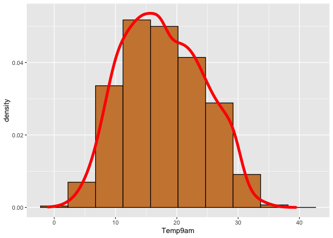<!-- -->

Es una distribución que se acerca a ser simétrica pero no lo es, por lo
que pensamos que tampoco es normal (tenemos tantos datos que si fuese
normal la distribución debería representar este hecho en la gráfica
anterior). De todas formas, vamos a comprobarlo con un boxplot.

``` r
boxplotTemp = boxplot(datos$Temp9am, col = "orange")
```

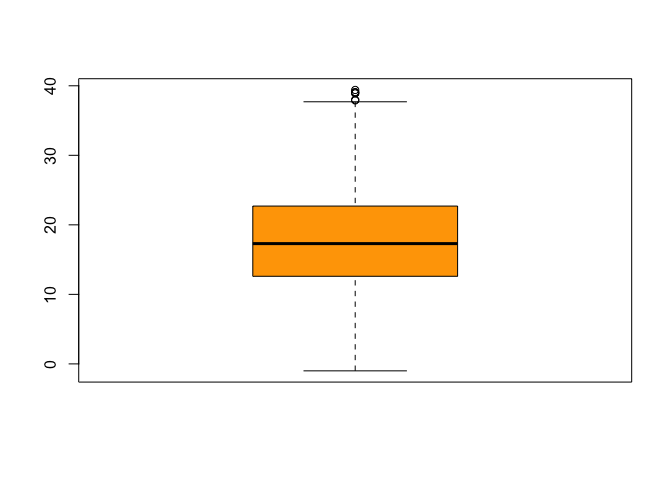<!-- -->

El boxplot nos aporta información más detallada, pues parece que solo
hay *outliers* por encima de la mediana. Es decir, se detectan valores
muy altos de temperatura en algunos puntos, pero para ver cuántos y
cuáles son, podemos mostrar el resultado del siguiente comando:

``` r
boxplotTemp$out
```

    ## [1] 37.9 39.4 39.0 38.9 39.1 38.0

Vemos que, efectivamente, todos los *outliers* son para temperaturas
altas, tal y como muestra el gráfico.

La información del boxplot se puede completar de alguna forma mostrando
la densidad de los puntos, como se hace a continuación:

``` r
ggplot(data = datos) + 
  geom_violin(mapping = aes(x=0,y = Temp9am))+
  scale_x_discrete(breaks = c()) +
  geom_boxplot(mapping = aes(y = Temp9am), fill = "darkseagreen")+
  geom_jitter(aes(x=0,y=Temp9am),position= position_jitter(w=0.075,h=0),
              col="blue", alpha = 0.05)
```

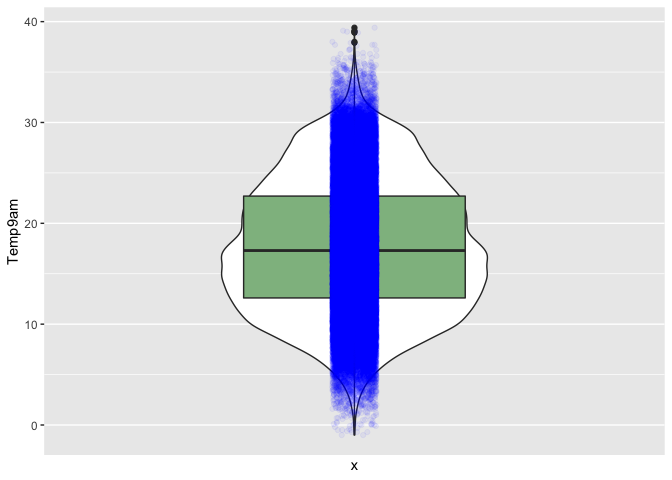<!-- -->

El *violin plot* nos muestra la función de densidad de los puntos, lo
cual nos sirve para comprobar que la distribución no es simétrica.

Para corroborar que no se trata de una distribución normal,
representamos un qqplot:

``` r
ggplot(datos, aes(sample = Temp9am)) + 
  geom_qq(alpha = 0.2, color = "blue") + 
  geom_qq_line()
```

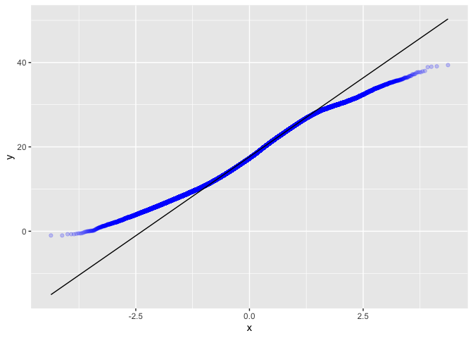<!-- -->

Este gráfico nos muestra que no se trata de una variable normal, pues
los puntos de los extremos se alejan del comportamiento esperado
representado por la línea negra.

Todo esto nos ha servido para hacernos una idea de cómo se comporta y
distribuye la variable *Temp9am*.

-   Variables categóricas:

Vamos a analizar la dirección del viento con los valores medidos a las
9am. Esto viene descrito por la variable *WindDir9am.* Las frecuencias
absolutas con las que aparecen estos valores son:

``` r
datos %>% 
  count(WindDir9am)
```

    ##    WindDir9am    n
    ## 1           E 5969
    ## 2         ENE 5150
    ## 3         ESE 4798
    ## 4           N 6839
    ## 5          NE 4617
    ## 6         NNE 4742
    ## 7         NNW 4100
    ## 8          NW 4038
    ## 9           S 5084
    ## 10         SE 5606
    ## 11        SSE 5573
    ## 12        SSW 4258
    ## 13         SW 4818
    ## 14          W 4918
    ## 15        WNW 4124
    ## 16        WSW 4214

Cuyas proporciones son las siguientes:

``` r
datos %>% 
  count(WindDir9am) %>% 
  mutate(WindDir9am,prop.table(n),n= NULL)
```

    ##    WindDir9am prop.table(n)
    ## 1           E    0.07570262
    ## 2         ENE    0.06531554
    ## 3         ESE    0.06085126
    ## 4           N    0.08673651
    ## 5          NE    0.05855570
    ## 6         NNE    0.06014103
    ## 7         NNW    0.05199878
    ## 8          NW    0.05121246
    ## 9           S    0.06447849
    ## 10         SE    0.07109882
    ## 11        SSE    0.07068030
    ## 12        SSW    0.05400264
    ## 13         SW    0.06110491
    ## 14          W    0.06237317
    ## 15        WNW    0.05230317
    ## 16        WSW    0.05344460

Representamos un diagrama de barras para poder observar esta información
de manera visual:

``` r
ggplot(datos) +
  geom_bar(mapping = aes(x = WindDir9am))
```

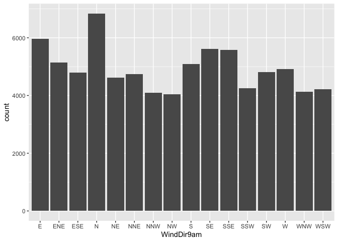<!-- -->

Vemos que todas las direcciones tienen aproximadamente el mismo número
de datos. Vamos a agruparlos en 4 direcciones, con el fin de tener la
información agrupada de forma que sea más facil de entender y utilizar.

``` r
norte <- c("N","NNE","NE","NNW")
este <- c("E","ENE","ESE","SE")
oeste <- c("NW","W","WNW","WSW")
sur <- c("S","SSW","SSE","SW")

datos$WindDir9am4[datos$WindDir9am %in% norte] <- "N"
datos$WindDir9am4[datos$WindDir9am %in% este] <- "E"
datos$WindDir9am4[datos$WindDir9am %in% oeste] <- "W"
datos$WindDir9am4[datos$WindDir9am %in% sur] <- "S"

ggplot(datos) +
  geom_bar(mapping = aes(x = WindDir9am4, fill = WindDir9am4))
```

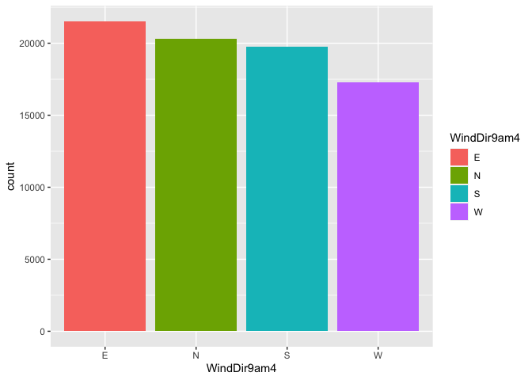<!-- -->

Vemos con este gráfico que se recoge un número diferente de medidas en
función de la dirección del viento.

Como esta transformación es de utilidad, vamos a repetirla para la
variable *WindDir3pm*.

``` r
norte <- c("N","NNE","NE","NNW")
este <- c("E","ENE","ESE","SE")
oeste <- c("NW","W","WNW","WSW")
sur <- c("S","SSW","SSE","SW")

datos$WindDir3pm4[datos$WindDir3pm %in% norte] <- "N"
datos$WindDir3pm4[datos$WindDir3pm %in% este] <- "E"
datos$WindDir3pm4[datos$WindDir3pm %in% oeste] <- "W"
datos$WindDir3pm4[datos$WindDir3pm %in% sur] <- "S"

ggplot(datos) +
  geom_bar(mapping = aes(x = WindDir3pm4, fill = WindDir3pm4))
```

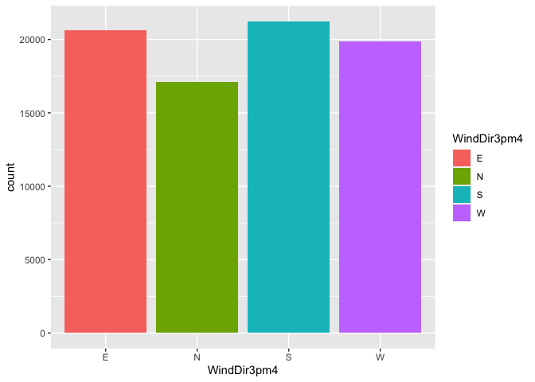<!-- --> Vemos
que la distribución cambia en función de la hora del día.

## Consulta de distinta información derivada del conjunto de datos

En esta sección, queremos conseguir cierta información sobre algunas
variables de nuestro *dataset* bajo ciertas condiciones:

-   Temperaturas medias por ciudad:

Sería lógico pensar que la temperatura variase en función del lugar
donde se mide. Por ello, a continuación se muestra la temperatura media
para cada variable relacionada con la temperatura de nuestro *dataset*
en función de la ciudad.

``` r
datos %>% 
  group_by(Location) %>% 
  summarise(TempMax = mean(MaxTemp), TempMin = mean(MinTemp),
            TempMedia9am = mean(Temp9am), TempMedia3pm = mean(Temp3pm)) %>% 
  arrange()
```

    ## # A tibble: 34 × 5
    ##    Location     TempMax TempMin TempMedia9am TempMedia3pm
    ##    <fct>          <dbl>   <dbl>        <dbl>        <dbl>
    ##  1 Albury          20.7    9.91         13.9         19.3
    ##  2 AliceSprings    29.7   14.0          22.0         28.4
    ##  3 Ballarat        17.5    7.36         11.3         16.0
    ##  4 Bendigo         20.7    8.78         13.6         19.4
    ##  5 Brisbane        26.5   16.4          21.9         24.8
    ##  6 Cairns          29.5   21.2          25.8         27.9
    ##  7 Canberra        20.5    7.46         12.9         18.9
    ##  8 Cobar           25.7   13.1          18.0         24.3
    ##  9 CoffsHarbour    23.8   14.7          20.1         22.2
    ## 10 Darwin          32.5   23.2          27.2         31.1
    ## # … with 24 more rows

-   Dirección predominante del viento según la ciudad:

También es posible que la dirección del viento cambie en función de la
ciudad en la que se mida, dependiendo de la ubicación u orientación de
esta.

``` r
datos %>% 
  group_by(Location) %>% 
  count(WindDir9am4) %>% 
  arrange(Location,desc(n)) %>% 
  filter(row_number() == 1) %>% 
  mutate(n = NULL, PredominatWindDir = WindDir9am4, WindDir9am4 = NULL)
```

    ## # A tibble: 34 × 2
    ## # Groups:   Location [34]
    ##    Location     PredominatWindDir
    ##    <fct>        <chr>            
    ##  1 Albury       E                
    ##  2 AliceSprings E                
    ##  3 Ballarat     N                
    ##  4 Bendigo      S                
    ##  5 Brisbane     S                
    ##  6 Cairns       S                
    ##  7 Canberra     S                
    ##  8 Cobar        E                
    ##  9 CoffsHarbour S                
    ## 10 Darwin       E                
    ## # … with 24 more rows

-   Medias de lluvia, humedad y temperatura en función de la cantidad de
    nubes:

La cantidad de nubes podría influir en variables como son la media de la
lluvia ese día, de la humedad a las 9am y a las 3pm y de la temperatura
a las 9am y a las 3pm.

``` r
datos %>% 
  group_by(CloudLevels) %>%
  summarise(LluviaMedia = mean(Rainfall), Humed9amMedia = mean(Humidity9am),
            Humed3pmMed = mean(Humidity3pm), Temp9amMed = mean(Temp9am),
            Temp3pmMed = mean(Temp3pm))
```

    ## # A tibble: 9 × 6
    ##   CloudLevels LluviaMedia Humed9amMedia Humed3pmMed Temp9amMed Temp3pmMed
    ##   <fct>             <dbl>         <dbl>       <dbl>      <dbl>      <dbl>
    ## 1 (-0.5,0.5]        0.100          49.5        27.3       18.5       26.2
    ## 2 (0.5,1.5]         0.515          58.2        38.5       19.0       25.0
    ## 3 (1.5,2.5]         0.896          61.3        42.0       19.2       24.7
    ## 4 (2.5,3.5]         1.29           63.0        44.2       18.6       23.8
    ## 5 (3.5,4.5]         1.84           66.9        48.6       17.8       22.6
    ## 6 (4.5,5.5]         2.40           69.1        51.9       17.5       21.8
    ## 7 (5.5,6.5]         3.01           71.4        55.2       17.3       21.2
    ## 8 (6.5,7.5]         4.31           75.3        62.9       16.8       19.9
    ## 9 (7.5,8.5]         7.12           81.8        71.1       15.3       17.9

Tal y como cabría esperar vemos que a mayor nubosidad la media de la
lluvia aumenta. También vemos que la humedad aumenta en ambos casos
conforme aumenta la presencia de nubes y que se observan menores
temperaturas también en este caso en ambas horas.

## Comportamiento de ciertas variables frente a otras

Nos interesa comprobar de forma gráfica y exploratoria cómo se comportan
unas variables frente a otras.

Una primera visualización general la podemos obtener usando la función
*ggpairs*:

-   GGPairs

``` r
paraggpairs <- datos %>% 
  select("MinTemp","MaxTemp","Rainfall","WindDir9am4","WindSpeed9am","Humidity9am",
         "Pressure9am","Temp9am","RainToday","CloudLevels")

library(GGally)
ggpairs(paraggpairs, progress = FALSE, mapping = ggplot2::aes(color = RainToday),
  lower = list(combo = wrap("facethist", binwidth = 0.25)))
```

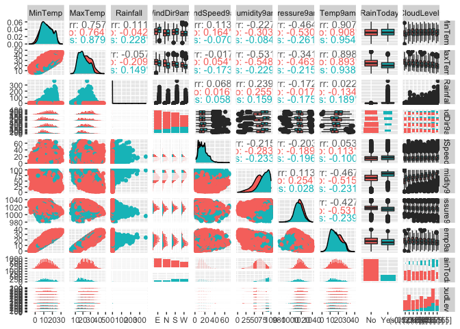<!-- -->

-   ¿Afecta la dirección del viento a su velocidad?

``` r
ggplot(datos) +
  geom_boxplot(mapping = aes(x = WindDir9am4, y = WindSpeed9am, fill = WindDir9am4)) +
  geom_jitter(aes(x = WindDir9am4, y = WindSpeed9am), width = 0.1, alpha = 0.3)
```

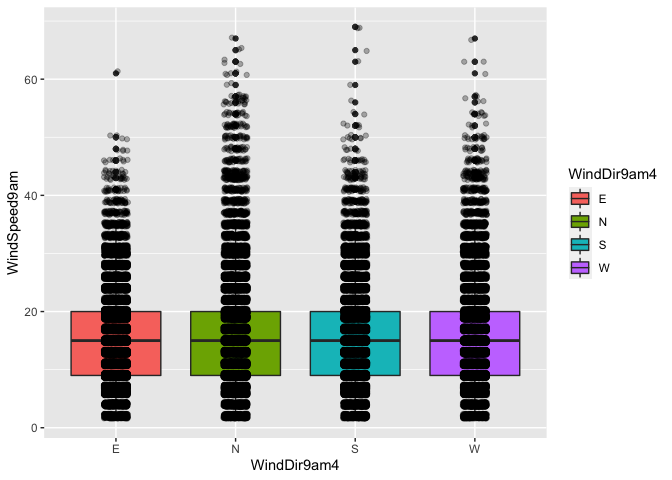<!-- -->

Dado que la dirección del viente solo puede tomar valores enteros,
observamos franjas donde no tenemos datos. Los boxplots nos permiten
comprobar que no existen diferencias relevates en la velocidad del
viento entre las distintas direcciones.

``` r
ggplot(datos) +
  geom_density(aes(x = WindSpeed9am, color = WindDir9am4))
```

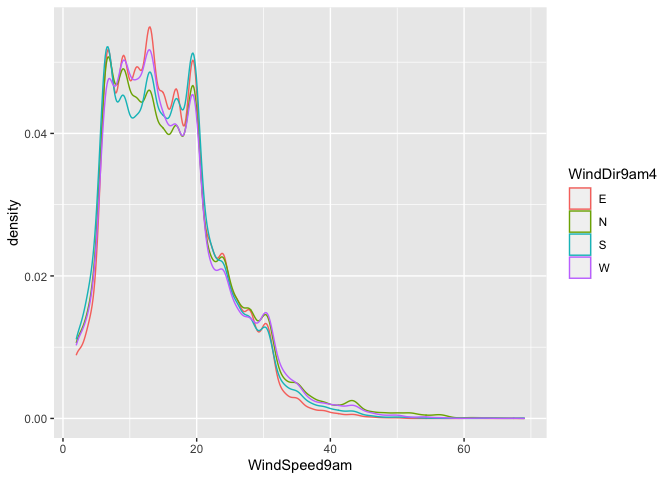<!-- -->

Vemos que las distribuciones de velocidad son muy similares para las 4
direcciones.

-   ¿Relación entre la humedad a las 9 de la mañana y la presión?

``` r
ggplot(datos) +
  geom_point(aes(Humidity9am, Pressure9am, col = RainToday))
```

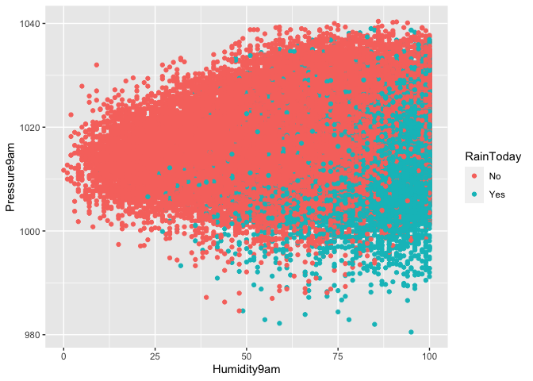<!-- -->

En este gráfico podemos observar que para los datos que presentan lluvia
tenemos mayor humedad y menor presión.

-   ¿Y entre la temperatura y la presión?

``` r
ggplot(datos) +
  geom_point(aes(Temp9am, Pressure9am, col = RainToday))
```

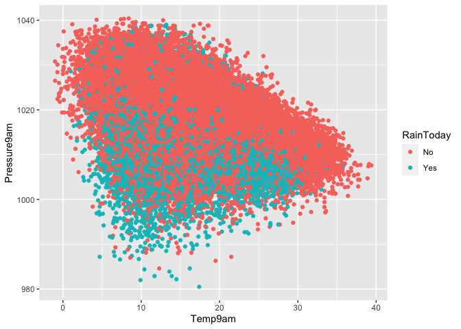<!-- -->

Vemos que los días que presentan lluvia presentan menor presión a las
9am. También observamos que a mayores temmperaturas las presiones son
menores en general.

# Contraste de hipótesis

Con el fín de comprobar si la diferencia de la temperatura media en dos
ciudades de Australia es debido a una fluctuación estadística de las
muestras tomadas, o si se corresponde a los valores de la población.

En primer lugar, comprobaremos si las temperaturas medias en dos
ciudades de Australia son diferentes con una significancia estadística
del 95% o si, sin embargo, la diferencia se podría explicar debido a las
desviaciones de la media al coger una muestra de variables aleatorias.

Realizamos el t-test de los siguientes vectores, que contienen las
temperaturas máximas medias en el año 2010 en las ciudades de Melbourne
y Albury.

``` r
datos %>% filter(format(Date,format="%Y")==2010, Location %in% c("Melbourne")) %>% 
  select(MaxTemp) %>% t() %>% as.vector() -> TempMelbourne
datos %>% filter(format(Date,format="%Y")==2010, Location %in% c("Albury")) %>% 
  select(MaxTemp) %>% t() %>% as.vector() -> TempAlbury
```

Tal y como nos revela el p-valor de la hipótesis nula, menor a 0.05,
vemos que podemos afirmar que la media de las temperaturas máximas en
Melbourne es mayor que la de Albury con una significancia mayor al 95%.

``` r
t.test(TempMelbourne,TempAlbury,alternative = "greater", conf.level = 0.95)
```

    ## 
    ##  Welch Two Sample t-test
    ## 
    ## data:  TempMelbourne and TempAlbury
    ## t = 1.9647, df = 350.58, p-value = 0.02512
    ## alternative hypothesis: true difference in means is greater than 0
    ## 95 percent confidence interval:
    ##  0.1960905       Inf
    ## sample estimates:
    ## mean of x mean of y 
    ##  21.04794  19.82667

Si repetimos el ejercicio para otros puntos metereológicos, como
MelbourneAirport y Albury, vemos que aunque en el año 2010 la
temperatura máxima media haya sido mayor en el primero de los puntos, no
podemos afirmar que este resultado sea significativo.

``` r
datos %>% filter(format(Date,format="%Y")==2010, Location %in% c("MelbourneAirport")) %>% 
  select(MaxTemp) %>% t() %>% as.vector() -> TempMelbourneAirport
datos %>% filter(format(Date,format="%Y")==2010, Location %in% c("Albury")) %>% 
  select(MaxTemp) %>% t() %>% as.vector() -> TempAlbury
t.test(TempAlbury, TempMelbourneAirport,alternative = "greater", conf.level = 0.95)
```

    ## 
    ##  Welch Two Sample t-test
    ## 
    ## data:  TempAlbury and TempMelbourneAirport
    ## t = 0.090985, df = 340.09, p-value = 0.4638
    ## alternative hypothesis: true difference in means is greater than 0
    ## 95 percent confidence interval:
    ##  -0.9538394        Inf
    ## sample estimates:
    ## mean of x mean of y 
    ##  19.82667  19.77098

# Regresión lineal

En este apartado haremos regresión lineal y ajustaremos la temperatura
máxima de cada día frente a la temperatura a las 9 am, que son dos
variables que cabría esperar que estuvieran relacionadas. Hacemos un
modelo y obtenemos los coeficientes.

``` r
(modelo = lm(MaxTemp ~ Temp9am, data=datos))
```

    ## 
    ## Call:
    ## lm(formula = MaxTemp ~ Temp9am, data = datos)
    ## 
    ## Coefficients:
    ## (Intercept)      Temp9am  
    ##      6.5997       0.9727

``` r
b0=modelo$coefficients[1]
b1=modelo$coefficients[2]
```

A continuación graficamos el diagrama de dispersión de estas dos
variables y el ajuste que hemos obtenido.

``` r
(plt = ggplot(datos) +
  geom_point(aes(y = MaxTemp, x = Temp9am), col = "darkgreen") +
  geom_abline(intercept = b0, slope = b1, color="blue", size = 1.5))
```

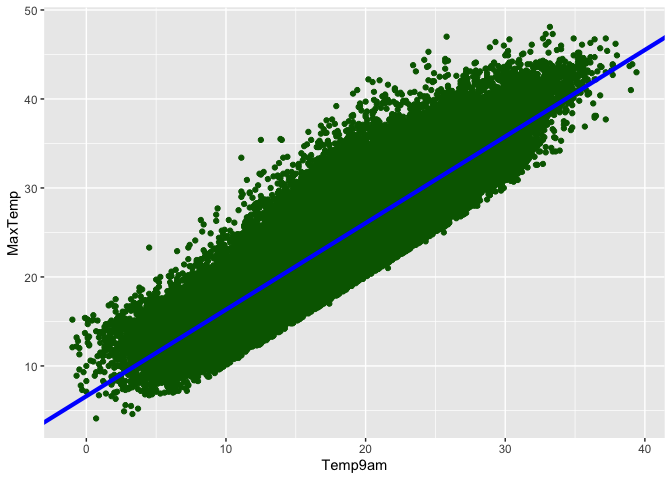<!-- -->

Vemos que las variables están estrechamente correlacionadas. Si
calculamos el coeficiente de correlación (*R*<sup>2</sup>) obtenemos:

``` r
cor(datos$Temp9am, datos$MaxTemp)^2
```

    ## [1] 0.8058646

Este valor nos indica que la temperatura a las 9 am está explicando el
80.6% del comportamiento de la temperatura máxima.

Ahora podemos usar este modelo lineal para, por ejemplo, predecir la
temperatura máxima de un día en el que a las 9am tenemos una temperatura
de 10º.

``` r
newTemp = 20
(MaxTempEstimada = b0 + b1 * newTemp)
```

    ## (Intercept) 
    ##     26.0537

Vemos que la temperatura máxima estimada resulta ser de 26º.

Realizamos ahora gráficos diagnósticos para estudiar el comportamiento
de los residuos en nuestro modelo.

``` r
par(mfrow = c(2, 2))
x = datos$Temp9am  
y = datos$MaxTemp
plot(x, y)
abline(lm(y ~ x), col="red", lwd=2)
plot(lm(y ~ x), which = 1:3)
```

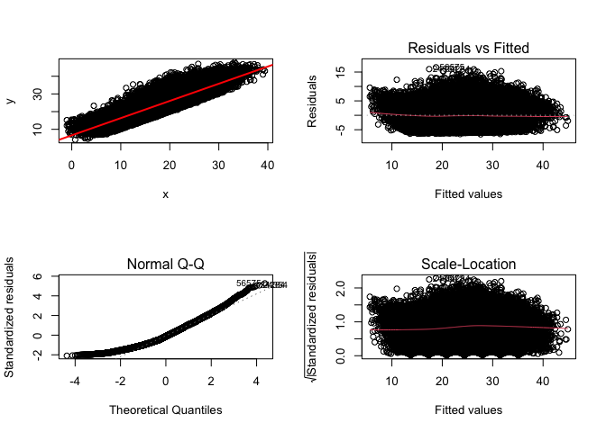<!-- -->

``` r
par(mfrow=c(1, 1))
```

Estos gráficos nos permiten comprobar que los residuos no se ajustan a
una distribución normal. En el gráfico QQ vemos como los puntos no se
distribuyen sobre la diagonal sobre la que deberían estar en caso de
tratarse de una distribución normal.

# Clasificación

Para terminar, probaremos a ajustar dos modelos de clasificación para
predecir cuando llueve al dia siguiente. Primero comprobamos si tenemos
correlaciones lineales entre las variables de entrada, mostradas en la
siguiente figura.

``` r
numvars <- sapply(datos, class) %in% c("integer","numeric")
C <- cor(datos[,numvars])
corrplot::corrplot(C, method = "circle")
```

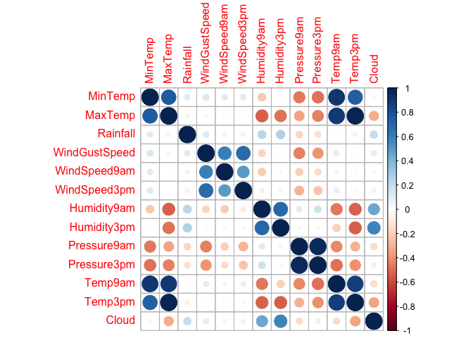<!-- -->

Vemos como las variables *MaxTemp* y *MinTemp*, *Pressure9am* y
*Pressure3pm*, *Humidity9am* y *Humidity3pm* o *Temp9am* y *Temp3pm*
están altamente correlaciones. También tenemos correlaciones
significativas entre las variables *WindGustSpeed*, *WindGust9am* y
*WindGust3pm*, que dejaremos en el *dataset* porque no están
suficientemente correlacionadas para poder explicar con una de ellas las
otras dos. De este modo, quitaremos las siguientes variables:

``` r
datos <- datos %>% select(-MaxTemp, -Temp9am, -MinTemp, -Humidity9am, -Pressure9am)
```

Quitamos otras variables que no nos interesa tener en cuenta para el
modelo, como la fecha, lugar o dirección del viento.

``` r
datos <- datos %>% select(-Date, -Location, -WindDir9am, -WindDir3pm, -WindGustDir)
```

Empezaremos con un modelo de árbol de decisiones, que nos ayudará a
determinar aquellas variables más relevantes para nuestro ajuste. En
este caso, hemos balanceado las clases en el *training* *set*.

``` r
set.seed(150)
trainIndex <- createDataPartition(datos$RainTomorrow, p = 0.8,      
                                  list = FALSE, times = 1)    

# Datos entrenamiento y test
fTR <- datos[trainIndex,]
fTS <- datos[-trainIndex,]

table(fTR$RainTomorrow)
```

    ## 
    ##    No   Yes 
    ## 48756 14324

``` r
# Under sampling
fTR <- ovun.sample(RainTomorrow~., data = fTR, method = "under", N = 30000)$data

fTR_eval <- fTR
fTS_eval <- fTS

table(fTR$RainTomorrow)
```

    ## 
    ##    No   Yes 
    ## 15676 14324

Seleccionamos los *inputs* para predecir si llueve al dia siguiente y
ajustamos el modelo.

``` r
library(xtable)
#Cross validation
ctrl <- trainControl(method = "cv",                        
                     number = 10,                          
                     summaryFunction = defaultSummary,     
                     classProbs = TRUE)                   

inputs <- fTR %>% select(-RainTomorrow, -Rainfall, -Cloud)

set.seed(150)
tree.fit <- train(x = inputs,  
                  y = fTR$RainTomorrow, 
                  method = "rpart",   
                  control = rpart.control(minsplit = 5,  
                                          minbucket = 5), 
                  parms = list(split = "gini"),         
                  tuneGrid = data.frame(cp = seq(0,0.1,0.0005)),
                  trControl = ctrl, 
                  metric = "Accuracy")
```

Viendo la importancia de las variables del modelo, nos damos cuenta de
que la temperatura y la velocidad del viento no ayudan a explicar cuando
llueve y cuando no, al menos de forma lineal.

``` r
#Measure for variable importance
plot(varImp(tree.fit,scale = FALSE))
```

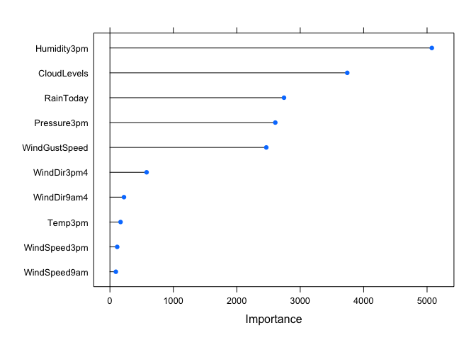<!-- -->

Descartamos estas variables y ajustamos un modelo de regresión
logística,

``` r
set.seed(150)
LogReg.fit <- train(form = RainTomorrow ~ . -Cloud -WindSpeed9am
                    -WindSpeed3pm -Temp3pm, 
                    data = fTR,               
                    method = "glm",                   
                    preProcess = c("center","scale"), 
                    trControl = ctrl,                 
                    metric = "Accuracy")  
```

Obtenemos que todas tienen un p-valor por debajo del 0.05, por lo que
son significativos para el modelo.

``` r
summary(LogReg.fit)
```

    ## 
    ## Call:
    ## NULL
    ## 
    ## Deviance Residuals: 
    ##     Min       1Q   Median       3Q      Max  
    ## -3.1197  -0.7092  -0.1759   0.6965   3.1615  
    ## 
    ## Coefficients:
    ##                        Estimate Std. Error z value Pr(>|z|)    
    ## (Intercept)            -0.15566    0.01674  -9.299  < 2e-16 ***
    ## Rainfall                0.08490    0.02596   3.270  0.00108 ** 
    ## WindGustSpeed           0.51694    0.01783  28.997  < 2e-16 ***
    ## Humidity3pm             1.26763    0.02279  55.615  < 2e-16 ***
    ## Pressure3pm            -0.46460    0.01773 -26.205  < 2e-16 ***
    ## RainTodayYes            0.17914    0.01869   9.587  < 2e-16 ***
    ## `CloudLevels(0.5,1.5]`  0.20565    0.04334   4.745 2.08e-06 ***
    ## `CloudLevels(1.5,2.5]`  0.25982    0.03668   7.082 1.42e-12 ***
    ## `CloudLevels(2.5,3.5]`  0.31003    0.03780   8.201 2.38e-16 ***
    ## `CloudLevels(3.5,4.5]`  0.44230    0.04446   9.949  < 2e-16 ***
    ## `CloudLevels(4.5,5.5]`  0.46621    0.04243  10.988  < 2e-16 ***
    ## `CloudLevels(5.5,6.5]`  0.59110    0.04747  12.451  < 2e-16 ***
    ## `CloudLevels(6.5,7.5]`  0.82399    0.05875  14.024  < 2e-16 ***
    ## `CloudLevels(7.5,8.5]`  0.63536    0.04858  13.079  < 2e-16 ***
    ## WindDir9am4N            0.14572    0.02107   6.915 4.68e-12 ***
    ## WindDir9am4S           -0.06020    0.01989  -3.026  0.00248 ** 
    ## WindDir9am4W           -0.04327    0.02059  -2.101  0.03563 *  
    ## WindDir3pm4N            0.11303    0.02016   5.606 2.07e-08 ***
    ## WindDir3pm4S           -0.06036    0.01990  -3.033  0.00242 ** 
    ## WindDir3pm4W            0.05286    0.02116   2.498  0.01250 *  
    ## ---
    ## Signif. codes:  0 '***' 0.001 '**' 0.01 '*' 0.05 '.' 0.1 ' ' 1
    ## 
    ## (Dispersion parameter for binomial family taken to be 1)
    ## 
    ##     Null deviance: 41528  on 29999  degrees of freedom
    ## Residual deviance: 26931  on 29980  degrees of freedom
    ## AIC: 26971
    ## 
    ## Number of Fisher Scoring iterations: 6

Finalmente, realizaremos un pequeño diagnostico del modelo. Predecimos
las clases en base al modelo de regresión logística.

``` r
#test
fTS_eval$LRprob <- predict(LogReg.fit, type="prob", newdata = fTS) # predict probabilities
fTS_eval$LRpred <- predict(LogReg.fit, type="raw", newdata = fTS) # predict classes 
```

Y calculamos la matriz de confusión del *test* *set*. Hemos obtenido una
*accuracy* del 79%.

``` r
(confusionMatrix(fTS_eval$LRpred, 
                fTS_eval$RainTomorrow, 
                positive = "Yes") -> tablaCon)
```

    ## Confusion Matrix and Statistics
    ## 
    ##           Reference
    ## Prediction   No  Yes
    ##        No  9796  868
    ##        Yes 2392 2712
    ##                                           
    ##                Accuracy : 0.7933          
    ##                  95% CI : (0.7868, 0.7996)
    ##     No Information Rate : 0.773           
    ##     P-Value [Acc > NIR] : 4.16e-10        
    ##                                           
    ##                   Kappa : 0.4879          
    ##                                           
    ##  Mcnemar's Test P-Value : < 2.2e-16       
    ##                                           
    ##             Sensitivity : 0.7575          
    ##             Specificity : 0.8037          
    ##          Pos Pred Value : 0.5313          
    ##          Neg Pred Value : 0.9186          
    ##              Prevalence : 0.2270          
    ##          Detection Rate : 0.1720          
    ##    Detection Prevalence : 0.3237          
    ##       Balanced Accuracy : 0.7806          
    ##                                           
    ##        'Positive' Class : Yes             
    ## 

La matriz de confusión es la tabla de contingencia de los valores
predichos por el modelo. En ella se ve la predicción de cuando va a
llover frente a cuando realmente llueve. Es decir, podemos ver los
positivos y negativos reales y los falsos positivos y negativos. Vemos
que tanto para cuando llueve como para cuando no, el modelo predice el
valor de referencia con un 80% de acierto (sensitividad y
especificidad). Esto mismo, lo vemos representado en el siguiente
gráfico tipo mosaico.

``` r
TablaContingencia <- t(tablaCon$table)
mosaicplot(TablaContingencia, las = 1, col=terrain.colors(nlevels(TablaContingencia)))
```

<!-- -->
